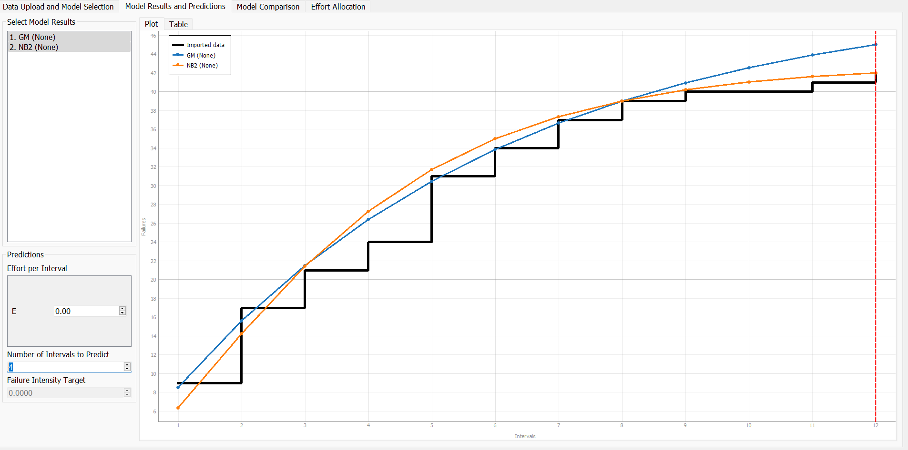
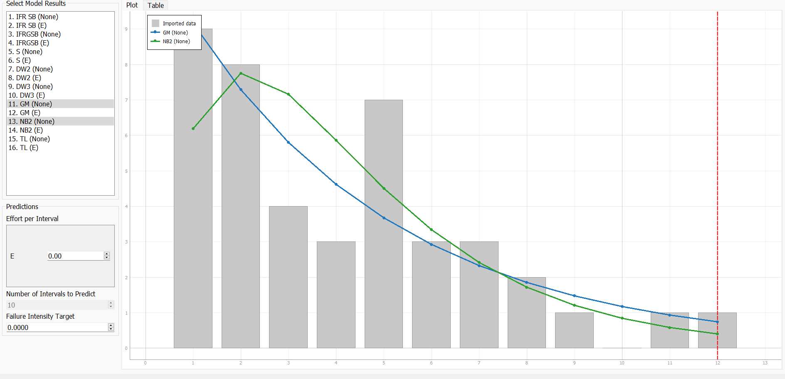

**SENG 438- Software Testing, Reliability, and Quality**

**Lab. Report \#5 – Software Reliability Assessment**
| Group \#:      |  14        |
| -------------- | ---------- |
| Student Names: |   Mary     |
|                |   Nicola   |
|                |   Tyler    |
|                |   Jaxon    |

# Introduction

The purpose of this lab is to measure the reliability of software using two different techniques. The two techniques used are Reliability Growth Testing (RGT) and Reliability Demo Charting (RDC). We will use both techniques to measure the reliability and quality of a hypothetical system and compare the efficacy and usability of each technique. We selected [Failure Report 1](./failure-data-set2/Failure_Data_Set/Failure%20Report%201.docx) as our system to assess. This system is a hypothetical front-end system, the failures are measured over the course of 12 hours. Each failure is documented, with the description, time of occurence, severity, and state.

# Assessment Using Reliability Growth Testing 

For our RGT, we selected C-SFRAT as our preferred tool due to its user-friendly interface. However, we encountered compatibility issues with the initial data sets. To address this, we modified Failure Report 1 to comply with C-SFRAT's required format. We established a time interval of 1 hour and assumed that the failures were uniformly distributed.

To provide an example of our cleaned data set, let's consider the first hour. During this interval, 9 errors were recorded, hence the execution time per failure is 0.11 (in hours):

| T | FC  | E |
| - | -   | - |
| 1 | 9   | 0.11|

[cleaned-data.xlsx](./cleaned-failure-data-set/cleaned-data.xlsx)

After running our data set through each model we decided to select two models to compare Geometric Mean (GM) with no covariate and Negative Binomial (Order 2) also with no covariate. The model comparsion can be found [here](./model_results.csv). Additionally, we will be running the models on 66% of our subset, so we can gauge the accuracy of the predictions by predicting the last 4 intervals.

Time to Failure plot:

From the models the failure rate / mean time to failure (MTTF) are:

| Dataset       | Failure rate  | MTTF            |
|-              |-              |-                |
| original      | 42/12 = 3.5   | 1/3.5 = 0.2857  |
| GM(none)      | 45/12 = 3.75  | 1/3.75 = 0.267  |
| NB2(none)     | 42/12 = 3.5   | 1/3.5 = 0.2857  |

As we can see the NB2 model's prediction was very accurate. The GM's predicition was off and presumed more errors would have occured.

Intensity plot:

From the failure intensity plot we can see a general trend down in failure intensity per interval.

## Acceptable range of failure rate

The acceptable range of failure rates vary depending on the software. If the acceptable range of failure rate was below 4 then this dataset would be in the acceptable range. However, if a firm decided that 3 errors per hour was the cutoff then the dataset would be unacceptable.

## Advantages and Disadvantages of RGT testing

### Advantages

- Predicting future results of your dataset is easy to accomplish with predefined models
- It is easy to compare models
- RGT testing provides objective metrics for the relability of your software

### Disadvantages

- The results of RGT testing are dependent on the quality of your data set.
- RGT testing has a limited scope it only concerns itself with software errors, and not usability / security issues

# Assessment Using Reliability Demonstration Chart 

# Comparison of Results

# Discussion on Similarity and Differences of the Two Techniques

Reliability Growth Testing and Reliability Demonstration Testing should both be done on software in an enviroment that is similar to the enviroment the software will be in when deployed. Both techniques evaluate the reliability of a piece of software, but each method serves a different purpose for evaluating reliability. Growth testing is used to assess the current reliability of the software, identify and eliminate faults in the software, and forecast future reliability. Reliability demonstration is used to verify if the software has reached a certain level of reliability such that it is deemed suitable for release. 

# How the team work/effort was divided and managed

We each performed each reliabilty technique on our own at first, and later once we were all familiar with each technique and how to perform each one, we came together to come up with the results we wanted to use for the report. 

# Difficulties encountered, challenges overcome, and lessons learned

This lab presented significant challenges not because of its content, but due to the tools required to complete it. Throughout the process, we encountered several issues with the tools, including the following:

## SRTAT

- Platform support
  - Most of our team members used an x86_64 Windows machine, but one member used an ARMv8.5 MacBook, which led to difficulties since the sMERFS library did not support the ARM instruction set. As a result, we were able to run the SRTAT on the MacBook, but could not process the models as the library was not supported, resulting in a `java.lang.UnsatisfiedLinkError` each time. Unfortunately, without access to the source code, we could not alleviate this issue.
- Model Support
  - We also experienced some issues running the models on the Windows machines. Initially, we encountered the same `java.lang.UnsatisfiedLinkError`, but were able to solve it by modifying the jar command to run SRTAT. 
  
    `java -D"java.library.path"=. -jar SRTAT.jar`
  - Despite this, most of the models produced errors when executing, and only the 'Geometric' and 'Littlewood and Varral's Bayesian Reliability' models completed successfully. Moreover, we could only select a single model at a time, which made comparisons difficult.
- Usability
  - We are typically able to diagnose issues when using unfamiliar software. However, we could not find any documentation or guides on using this software, and the help link displayed in the software was dead. This made the software difficult to use and hindered our progress in completing the lab.

## C-SFRAT

- Platform support
  - We ran into the same issue as SRTAT, the program properly ran on the Windows machines. No installer was provided for MacOS, thus we need to complile the program from the source code. However, the python libraries the program used do not support ARM.
- Data format
  - We had to change the dataset format to be used with C-SFRAT. Aubertine et al. [[1](https://doi.org/10.1016/j.softx.2021.100909)] described the dataset format required for C-SFRAT. The [dataset](./failure-data-set2/Failure_Data_Set/Failure%20Report%201.docx) we used listed all the failures and their occurence time, we had to adjust this data by defining a fixed time interval, and uniformly distributing the errors. This potentially reduces the accuracy of the dataset, however it is a neccesary tradeoff due to the difficulties experienced.

## RDC-11

- Data format
  - RDC-11 required us to change our data format. The instruction and tooltips contained in the excel sheet are not very clear. Fortunately we found a few research papers that explained how a RDC works [[2](https://doi.org/10.1109/ICSM.2005.46), [3](http://robertvbinder.com/wp-content/uploads/rvb-pdf/arts/Testers-Dashboard-Final.pdf), [4](http://sourceforge.net/projects/rdc/)].
- RDC generation
  - We were not able to use RDC-11 as the RDC would not update after inputing the data. The line graph whould update, however we could not increase the range of the data captured, hence we were not able to capture our entire data set. The instructions to increase the range of the failure data are out of date with modern versions of Excel. Increasing the range manually also did not work as the data was not getting calculated in the `plot graph` sheet.

# Comments/feedback on the lab itself

There needs to be more explanations on the software used in this lab. An extra session going over the software would be useful.

# References

[1]   Jacob Aubertine, Kenan Chen, Vidhyashree Nagaraju, and Lance Fiondella. 2022. A covariate software tool to guide test activity allocation. SoftwareX 17, (January 2022), 100909. DOI:https://doi.org/10.1016/j.softx.2021.100909

[2]   Pankaj Bhawnani, B.H. Far, and G. Ruhe. 2005. Explorative study to provide decision support for software release decisions. In 21st IEEE International Conference on Software Maintenance (ICSM’05), 617–620. DOI:https://doi.org/10.1109/ICSM.2005.46

[3]   Robert Binder and Peter Lakey. 2010. The Tester’s Dashboard: Release Decision Support. Retrieved from http://robertvbinder.com/wp-content/uploads/rvb-pdf/arts/Testers-Dashboard-Final.pdf

[4]   Robert V. Binder. RDC: The Reliability Demo Chart. http://sourceforge.net/projects/rdc/ (accessed March 30th, 2023).
