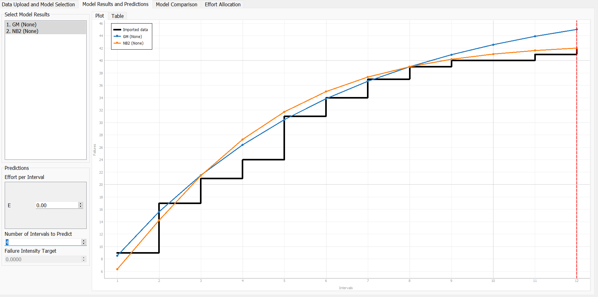
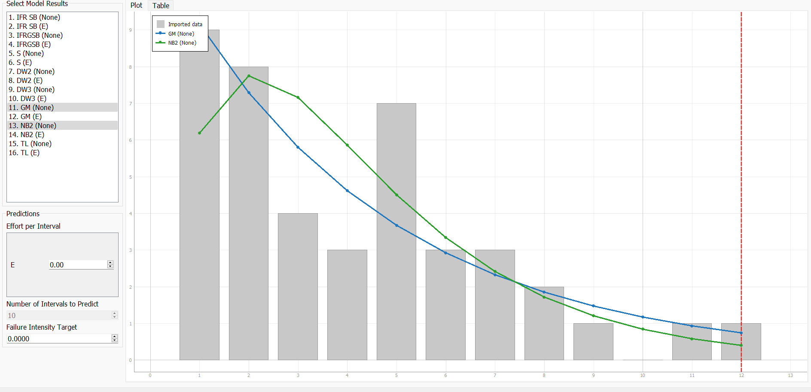

**SENG 438- Software Testing, Reliability, and Quality**

**Lab. Report \#5 – Software Reliability Assessment**
| Group \#:      |  14        |
| -------------- | ---------- |
| Student Names: |   Mary     |
|                |   Nicola   |
|                |   Tyler    |
|                |   Jaxon    |

# Introduction

# Assessment Using Reliability Growth Testing 

For our Reliability Growth Testing (RGT), we selected C-SFRAT as our preferred tool due to its user-friendly interface. However, we encountered compatibility issues with the initial data sets. To address this, we modified Failure Report 1 to comply with C-SFRAT's required format. We established a time interval of 1 hour and assumed that the failures were uniformly distributed.

To provide an example of our cleaned data set, let's consider the first hour. During this interval, 9 errors were recorded, hence the execution time per failure is 0.11 (in hours):

| T | FC  | E |
| - | -   | - |
| 1 | 9   | 0.11|

[cleaned-data.xlsx](./cleaned-failure-data-set/cleaned-data.xlsx)

After running our data set through each model we decided to select two models to compare Geometric Mean (GM) with no covariate and Negative Binomial (Order 2) also with no covariate. The model comparsion can be found [here](./model_results.csv). Additionally, we will be running the models on 66% of our subset, so we can gauge the accuracy of the predictions by predicting the last 4 intervals.

Time to Failure plot:

From the models the failure rate / mean time to failure (MTTF) are:

| Dataset       | Failure rate  | MTTF            |
|-              |-              |-                |
| original      | 42/12 = 3.5   | 1/3.5 = 0.2857  |
| GM(none)      | 45/12 = 3.75  | 1/3.75 = 0.267  |
| NB2(none)     | 42/12 = 3.5   | 1/3.5 = 0.2857  |

As we can see the NB2 model's prediction was very accurate. The GM's predicition was off and presumed more errors would have occured.

Intensity plot:

From the failure intensity plot we can see a general trend down in failure intensity per interval.

## Acceptable range of failure rate

The acceptable range of failure rates vary depending on the software. If the acceptable range of failure rate was below 4 then this dataset would be in the acceptable range. However, if a firm decided that 3 errors per hour was the cutoff then the dataset would be unacceptable.

## Advantages and Disadvantages of RGT testing

### Advantages

- Predicting future results of your dataset is easy to accomplish with predefined models
- It is easy to compare models
- RGT testing provides objective metrics for the relability of your software

### Disadvantages

- The results of RGT testing are dependent on the quality of your data set.
- RGT testing has a limited scope it only concerns itself with software errors, and not usability / security issues

# Assessment Using Reliability Demonstration Chart 

# Comparison of Results

# Discussion on Similarity and Differences of the Two Techniques

# How the team work/effort was divided and managed

# Difficulties encountered, challenges overcome, and lessons learned

This lab presented significant challenges not because of its content, but due to the tools required to complete it. Throughout the process, we encountered several issues with the tools, including the following:

## SRTAT

- Platform support
  - Most of our team members used an x86_64 Windows machine, but one member used an ARMv8.5 MacBook, which led to difficulties since the sMERFS library did not support the ARM instruction set. As a result, we were able to run the SRTAT on the MacBook, but could not process the models as the library was not supported, resulting in a `java.lang.UnsatisfiedLinkError` each time. Unfortunately, without access to the source code, we could not alleviate this issue.
- Model Support
  - We also experienced some issues running the models on the Windows machines. Initially, we encountered the same `java.lang.UnsatisfiedLinkError`, but were able to solve it by modifying the jar command to run SRTAT. 
  
    `java -D"java.library.path"=. -jar SRTAT.jar`
  - Despite this, most of the models produced errors when executing, and only the 'Geometric' and 'Littlewood and Varral's Bayesian Reliability' models completed successfully. Moreover, we could only select a single model at a time, which made comparisons difficult.
- Usability
  - We are typically able to diagnose issues when using unfamiliar software. However, we could not find any documentation or guides on using this software, and the help link displayed in the software was dead. This made the software difficult to use and hindered our progress in completing the lab.

## C-SFRAT

## RDC-11

- Data format
  - RDC-11 required us to change our data format. The instruction and tooltips contained in the excel sheet are not very clear. Fortunately we found a few research papers that explained how a RDC works [[1](https://doi.org/10.1109/ICSM.2005.46), [2](http://robertvbinder.com/wp-content/uploads/rvb-pdf/arts/Testers-Dashboard-Final.pdf), [3](http://sourceforge.net/projects/rdc/)].
- RDC generation

# Comments/feedback on the lab itself

# References

[1]   Pankaj Bhawnani, B.H. Far, and G. Ruhe. 2005. Explorative study to provide decision support for software release decisions. In 21st IEEE International Conference on Software Maintenance (ICSM’05), 617–620. DOI:https://doi.org/10.1109/ICSM.2005.46

[2]   Robert V. Binder and Peter Lakey. 2010. The Tester’s Dashboard: Release Decision Support.

[3]   Robert V. Binder. RDC: The Reliability Demo Chart. http://sourceforge.net/projects/rdc/ (accessed March 30th, 2023).

